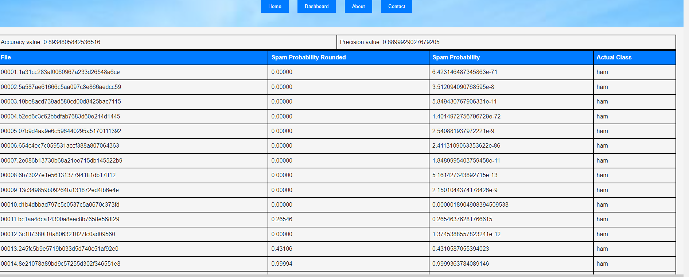

**Juan Consuegra**, **Anthony Ciceu**

## Project Overview

Our **Spam Detector** is a robust email classification system designed to determine whether a specific email is spam or legitimate (ham). The core mechanism of the system is based on a **Bag-of-Words** model, which represents text by the frequency of occurrence of words in a given email. This data is then processed using the **Naive Bayes** algorithm to predict whether the email is spam.

### How It Works
1. **Bag-of-Words Model**: 
   - The model represents each email by counting the frequency of each word it contains. 
   - It then calculates the probability of each word appearing in a spam email versus a ham (non-spam) email.
   
2. **Naive Bayes Classifier**: 
   - The Naive Bayes classifier is applied to the Bag-of-Words model. It computes the probability that a given email is spam based on the presence of certain words. 
   - The model divides the probability of a word appearing in spam emails by the sum of the probabilities of the word appearing in both spam and ham emails.
   
3. **Calculation of Spam Probability**:
   - The final spam probability is computed by multiplying the probabilities for all words in the email, giving an overall indication of whether the email is spam.
   - A higher probability indicates a higher likelihood that the email is spam.

   The resulting probabilities and accuracy statistics are displayed on a web interface, providing users with insight into the model’s performance, such as precision and accuracy.

   

## Future improvements
While our model demonstrates high accuracy, there are areas for improvement that were not fully implemented due to time constraints:

1. **Laplace Smoothing**:
   - One limitation occurs when the model encounters a word not present in the training data. This results in a zero probability for that word, adversely affecting the overall accuracy.
   - To mitigate this, we plan to implement **Laplace Smoothing**. This involves adding a constant value (usually 1) to both the numerator and denominator during the probability calculation, ensuring that no probability is zero.

2. **Stop Word Removal**:
   - Some common words, like "the" and "and," are often irrelevant in spam classification and contribute little to the model's accuracy. These words, known as **stop words**, tend to have a spam probability close to 0.5, indicating neutrality.
   - By adding conditions to the `getWordFrequency()` function, we can eliminate such stop words, improving the classifier's precision.

## How to Run
To run the **Spam Detector** on your local machine, follow these steps:

1. **Clone the Repository**: 
   - Use the command `git clone [url]` to clone this repository to your local machine.
   
2. **Install GlassFish**: 
   - **GlassFish 7.0.0** (or higher) is required for hosting the application. Ensure you use a compatible **JDK 11** or **JDK 8** for full functionality.
   - After installation, create an instance of GlassFish and configure it to run as a web server.
   
3. **Deploy the Application**: 
   - Once GlassFish is set up, deploy the `SpamDetectorServer` on the GlassFish instance.
   
4. **Access the Client Interface**:
   - Open the `SpamDetectorClient/index.html` file in your browser to access the user interface. 
   - The navigation bar will provide access to various sections of the site, including the spam detection interface and model statistics.

## Resources 
Below are the key resources we referred to during the development of this spam detector:

1. [Introduction to the Bag-of-Words Model](https://machinelearningmastery.com/gentle-introduction-bag-words-model/)
2. [Naive Bayes Classification Performance](https://www.baeldung.com/cs/naive-bayes-classification-performance)
3. [Bag-of-Words Model on Wikipedia](https://en.wikipedia.org/wiki/Bag-of-words_model)
4. [Naive Bayes Spam Filtering on Wikipedia](https://en.wikipedia.org/wiki/Naive_Bayes_spam_filtering)

